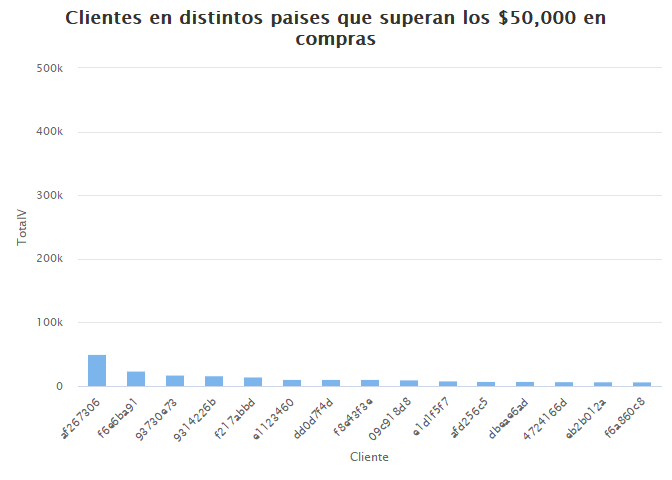
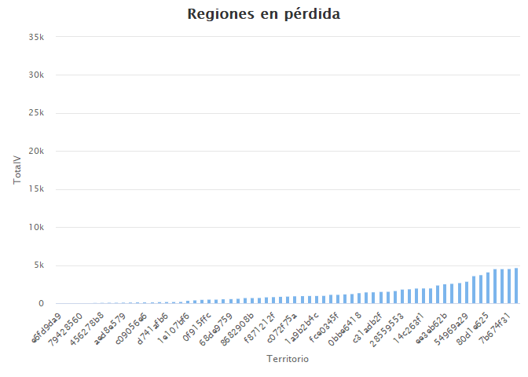

dw-2022-parcial-1
================
Tepi
9/19/2022

# Examen parcial

Indicaciones generales:

-   Usted tiene el período de la clase para resolver el examen parcial.

-   La entrega del parcial, al igual que las tareas, es por medio de su
    cuenta de github, pegando el link en el portal de MiU.

-   Pueden hacer uso del material del curso e internet (stackoverflow,
    etc.). Sin embargo, si encontramos algún indicio de copia, se
    anulará el exámen para los estudiantes involucrados. Por lo tanto,
    aconsejamos no compartir las agregaciones que generen.

## Sección I: Preguntas teóricas.

-   Existen 10 preguntas directas en este Rmarkdown, de las cuales usted
    deberá responder 5. Las 5 a responder estarán determinadas por un
    muestreo aleatorio basado en su número de carné.

-   Ingrese su número de carné en `set.seed()` y corra el chunk de R
    para determinar cuáles preguntas debe responder.

``` r
set.seed("20200402") 
v<- 1:10
preguntas <-sort(sample(v, size = 5, replace = FALSE ))

paste0("Mis preguntas a resolver son: ",paste0(preguntas,collapse = ", "))
```

    ## [1] "Mis preguntas a resolver son: 2, 4, 6, 7, 9"

### Listado de preguntas teóricas

1.  Para las siguientes sentencias de `base R`, liste su contraparte de
    `dplyr`:

    -   `str()`
    -   `df[,c("a","b")]`
    -   `names(df)[4] <- "new_name"` donde la posición 4 corresponde a
        la variable `old_name`
    -   `df[df$variable == "valor",]`

2.  Al momento de filtrar en SQL, ¿cuál keyword cumple las mismas
    funciones que el keyword `OR` para filtrar uno o más elementos una
    misma columna?

3.  ¿Por qué en R utilizamos funciones de la familia apply
    (lapply,vapply) en lugar de utilizar ciclos?

4.  ¿Cuál es la diferencia entre utilizar `==` y `=` en R?

5.  ¿Cuál es la forma correcta de cargar un archivo de texto donde el
    delimitador es `:`?

6.  ¿Qué es un vector y en qué se diferencia en una lista en R?

7.  ¿Qué pasa si quiero agregar una nueva categoría a un factor que no
    se encuentra en los niveles existentes?

8.  Si en un dataframe, a una variable de tipo `factor` le agrego un
    nuevo elemento que *no se encuentra en los niveles existentes*,
    ¿cuál sería el resultado esperado y por qué?

    -   El nuevo elemento
    -   `NA`

9.  En SQL, ¿para qué utilizamos el keyword `HAVING`?

10. Si quiero obtener como resultado las filas de la tabla A que no se
    encuentran en la tabla B, ¿cómo debería de completar la siguiente
    sentencia de SQL?

    -   SELECT \* FROM A \_\_\_\_\_\_\_ B ON A.KEY = B.KEY WHERE
        \_\_\_\_\_\_\_\_\_\_ = \_\_\_\_\_\_\_\_\_\_

Extra: ¿Cuántos posibles exámenes de 5 preguntas se pueden realizar
utilizando como banco las diez acá presentadas? (responder con código de
R.)

## Sección II Preguntas prácticas.

-   Conteste las siguientes preguntas utilizando sus conocimientos de R.
    Adjunte el código que utilizó para llegar a sus conclusiones en un
    chunk del markdown.

A. De los clientes que están en más de un país,¿cuál cree que es el más
rentable y por qué?

B. Estrategia de negocio ha decidido que ya no operará en aquellos
territorios cuyas pérdidas sean “considerables”. Bajo su criterio,
¿cuáles son estos territorios y por qué ya no debemos operar ahí?

### I. Preguntas teóricas

“Mis preguntas a resolver son: 2, 4, 6, 7, 9”

DOS: Los Keywords pueden ser BETWEEN o IN, ya que son un rango de
elementos que pueden filtrarse de la tabla. Ambos filtran varios
elementos, pero trabajan diferente, por eso incluí los dos.

CUATRO: “==” se usa cuando estamos haciendo una comparación (valor A es
igual a valor B), mientras que “=” se usa para asignarle un valor a una
variable.

SEIS: Un vector es una estructura que puede almacenar n cantidad de
valores (al igual que la lista), pero la diferencia es que un vector
solo puede contener n cantidad de datos DEL MISMO TIPO, mientras que la
lista puede contener diferentes tipos de valores.

SIETE: Si tratamos de hacer eso, le agregará un valor NULL ya que no
existe en los niveles

NUEVE: Lo usamos cuando queremos agregar elementos que cumplan con
cierta condición a una query. Se usa este keyword porque al hacer
agregaciones no se puede usar el keyword WHERE.

``` r
factorial(10)/factorial(10-5)
```

    ## [1] 30240

``` r
paste0("Se pueden hacer 30240 examenes distintos")
```

    ## [1] "Se pueden hacer 30240 examenes distintos"

## A

``` r
parcial_anonimo %>% select(Cliente, Venta, Pais) %>% group_by(Cliente) %>% summarise(TotalV=sum(Venta
), Paises = n_distinct(Pais) > 1) %>% filter(TotalV>50000) %>% arrange(desc(TotalV)) %>% hchart("column", 
hcaes(x = Cliente, y = TotalV)) %>% hc_title(text = 
"<b>Clientes en distintos paises que superan los $50,000 en compras</b>")
```

<!-- -->

``` r
paste0("El cliente mas rentables es af267306 porque es el que mas nos compra en diferentes
       paises")
```

    ## [1] "El cliente mas rentables es af267306 porque es el que mas nos compra en diferentes\n       paises"

## B

Asumimos que se cubren costos cuando las ventas superan los $40,000

``` r
parcial_anonimo %>% select(Territorio, Venta) %>% group_by(Territorio) %>% summarise(TotalV=sum(Venta
)) %>% filter(TotalV<40000) %>% arrange(TotalV) %>% hchart("column", 
hcaes(x = Territorio, y = TotalV)) %>% hc_title(text = 
"<b>Regiones en pérdida</b>")
```

<!-- -->

``` r
paste0("La gráfica muestra los territorios en los que ya no debemos operar, ya que
       en la cola inferior algunos ni reportan ventas y las pérdidas de la región
       más grande son del 25%")
```

    ## [1] "La gráfica muestra los territorios en los que ya no debemos operar, ya que\n       en la cola inferior algunos ni reportan ventas y las pérdidas de la región\n       más grande son del 25%"
